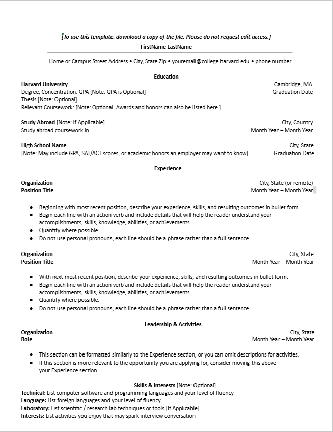
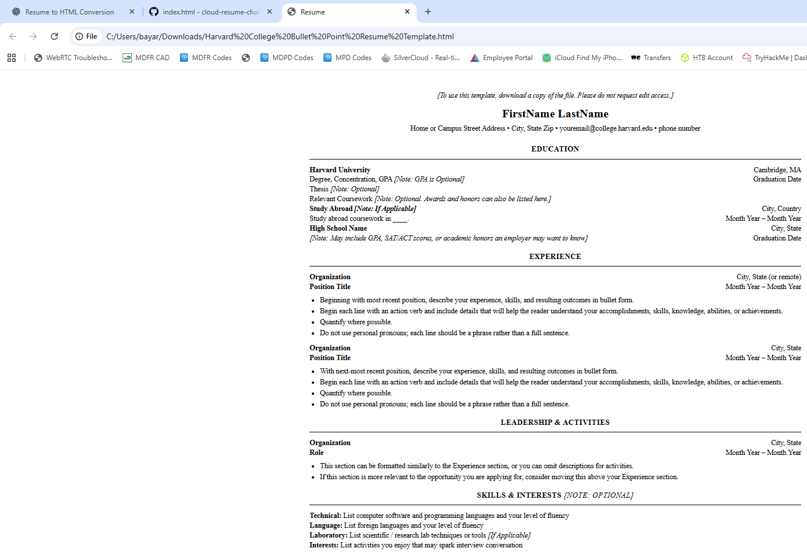

# Frontend Technical Specification

- Create a static website that serves an html resume.

## Resume Format Considerations

I live in the US and the resumes in word/pdf are suppose to exclude information. Ex. Age, Relationship. US resumes don't often include GPA grades. 

In US we use a similar format of resume common in Canada.

I'm going to use the [Harvard Resume Template format](https://careerservices.fas.harvard.edu/resources/bullet-point-resume-template/) as the basis of my resume.

### Harvard Resume Format Generation

I know HTML very well, so I'm going to let GenAI do the heavy lifting and generate out the HTML and possibly CSS and from there I will manually refactor the code to my preferred standard.

 Prompt to ChatGPT 5:

 ```text
Convert this resume format into HTML.
Please don't use a css framework.
Please use the least amount of css tags.
 ```

 Image provided to LLM
 

This is the [generated output](./docs/jan-5-2025-resume.html) which I will modify.

This is what the generated HTML looks like unaltered:



## HTML Adjustments

- UTF8 will support most languages, I plan to use English so we'll leave this meta tag in.
- Because we will be applying mobile styling to our website we'll include the viewport meta tag width=device-width so mobile styling scales normally.
- We'll extract our styles into its own stylesheet after we are happy with our HTML markup
- We'll simplify our HTML markup css selector to be as minimal as possible.
- For the HTML page I'll use soft tabs two spaces because I mostly code in Ruby and that's the standard tab format.